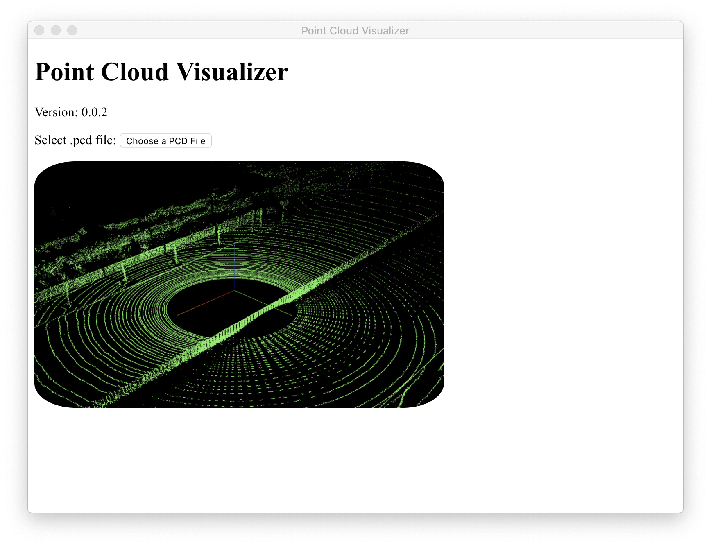
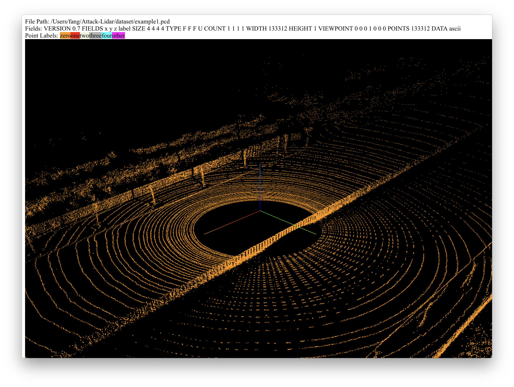

# Point Cloud Visualizer

This is a front-end for point cloud visualisation which supports ``.pcd`` format in ascii and binary. It is based on electron, threejs and ``PCDLoader`` by [Filipe Caixeta](http://filipecaixeta.com.br/). 

## Currently Supported Features
- [x] Color labelling each point
- [x] GUI to change color and point size
- [x] Free aspect
- [x] Info panel

## TODOs
- [ ] Add supports for binary compressed point cloud dataset
- [ ] Visualize the intensity of the point cloud
- [ ] Visualize obstacle detection by the Apollo CNN segmentation

