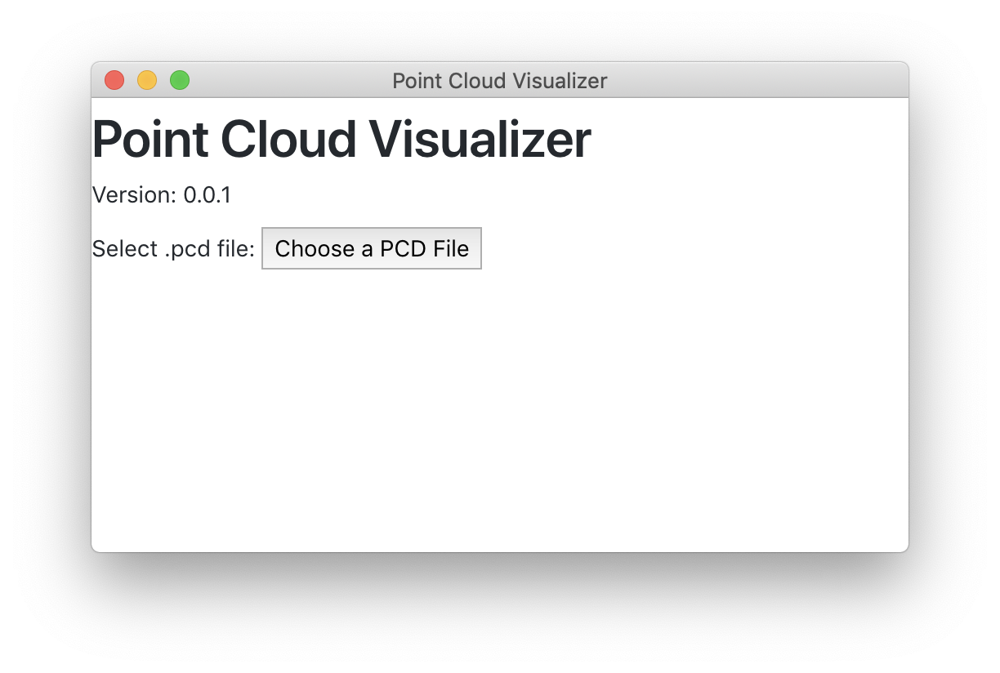
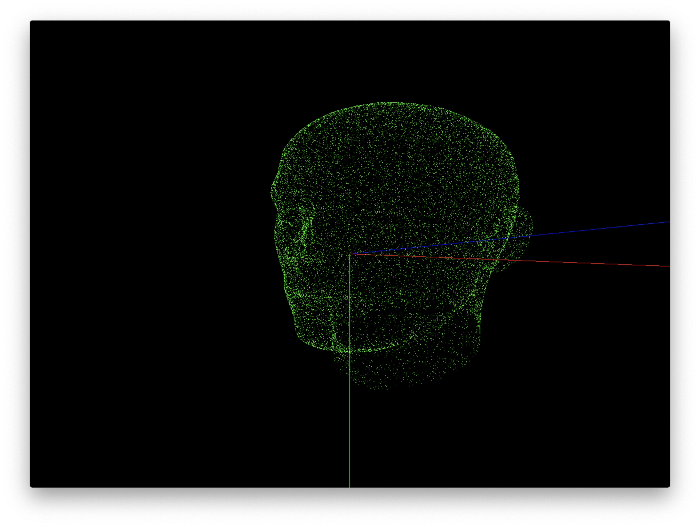

# Point Cloud Visualizer

This is a front-end for point cloud visualisation which supports ``.pcd`` format in ascii and binary. It is based on electron, threejs and ``PCDLoader`` by [Filipe Caixeta](http://filipecaixeta.com.br/). 

